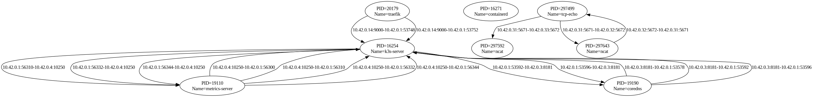

# Connection Tracing Overview

This repository contains two components that work together to observe TCPv4 activity on a system and transform those observations into a visual network graph:

1. **ebpf_netflow_tracer** — a bpftrace program that monitors TCP connections and prints structured connection events.  
2. **net_visualizer** — a Golang tool that consumes the ebpf_netflow_tracer output and generates a DOT-format graph representing process-to-process communication.

---

## ebpf_netflow_tracer

The **ebpf_netflow_tracer** component is a small eBPF/bpftrace script designed to observe TCPv4 connections made by processes running on the system. It attaches to relevant kernel functions to capture connection attempts and reports each observed event in a consistent, structured format.

### What ebpf_netflow_tracer does

- Monitors IPv4 TCP connections initiated or accepted by user-space processes.
- Captures information about both endpoints of the connection.
- Associates each network event with metadata about the process responsible for it.
- Outputs each connection as a single line of text so it can be streamed or piped into other tools.

### ebpf_netflow_tracer output format

Each observed connection is printed as:

```
<remote-ip>:<remote-port><direction-arrow><local-ip>:<local-port>|<process metadata>
```

Where:

- **remote-ip:remote-port** — the peer endpoint.  
- **local-ip:local-port** — the local endpoint.  
- **direction-arrow** — indicates the direction of the connection:  
  - `→` for outgoing connections  
  - `←` for incoming connections  
- **process metadata** — information such as PID, executable name, or command-line details (depending on the tracer implementation).

An example trace is provided in `net_visualizer/example.trace`.

---

## net_visualizer (Golang)

The **net_visualizer** is a Golang program that consumes the line-oriented output from **ebpf_netflow_tracer** and builds a directed graph representing communication between processes. The graph is emitted in DOT format, which can be used with Graphviz and similar tools for visualization.

### What net_visualizer does

- Reads ebpf_netflow_tracer connection events from standard input.
- Parses each connection line to extract:
  - Local and remote addresses  
  - Direction of communication  
  - Process identity or metadata  
- Treats each process as a graph node.
- Treats each observed TCP connection as a directed edge.
- Deduplicates edges so repeated connections do not clutter the graph.
- Emits a DOT graph describing the connectivity.

### Input

The program expects streamed or file-based ebpf_netflow_tracer output, for example:

```
cat example.trace | go run main.go
```

Each line must match the ebpf_netflow_tracer output format described above.

### Output

The output is a DOT-format graph describing:

- Each unique process as a node.
- Each observed (and deduplicated) TCP connection as a directed edge from source process to destination process.

The output can be piped directly into Graphviz, for example:

```
go run main.go < example.trace | dot -Tpng -o graph.png
```

Example output:


